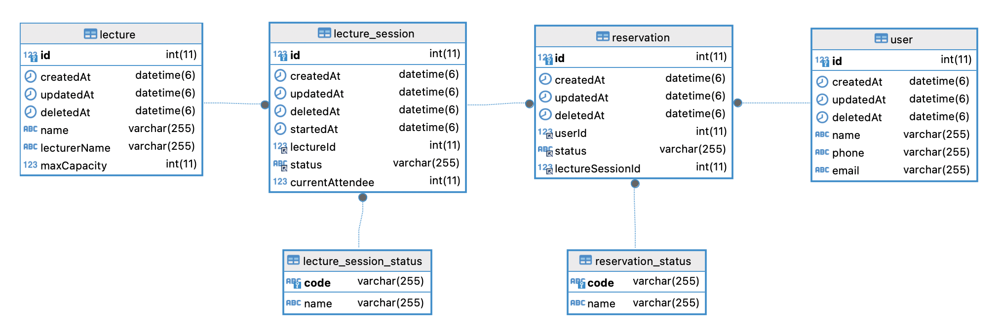

# 2주차 - TDD & 클린 아키텍처 

## 테이블 정의서

과제 해결을 위한 테이블 설계의 핵심은 크게 2가지 였습니다.
1. 극단적인 정규화는 지양하면서 락을 최소화하는 방향으로 설계하자.
2. 조금 더 현실적이고 확장성을 생각해 설계해보자

### 1. 락을 최소화하는 방향으로 설계하자.

먼저 저는 특강 신청을 위한 테이블 설계에서 "특강"이라는 핵심 단어의 정의를 먼저 찾아봤습니다.

> ### 특강  
> 특별히 하는 강의
> - 우리말 사전(**https://opendict.korean.go.kr/search/searchResult?focus_name_top=query&query=특강**)**
 

특강의 성질은 **비정기성**을 띄는 강의라고 정의합니다.  
그렇기 때문에 정기적인 강의라면 필요한 스케줄이라는 이름의 테이블 보단 비정기성을 의미하는 세션이라는 단어를 가져와 설계했습니다.

결과적으로 요구 사항을 만족하기 위해 필요한 핵심적인 테이블은 아래처럼 정의 했습니다.
1. 특강 : 특강정보를 담는 특강 테이블
2. 특강세션 : 날짜별 신청 가능한 특강을 관리하는 테이블
3. 신청(예약) : 유저의 신청 정보를 가진 테이블

물론 특강과 특강 세션은 하나의 테이블로도 가능합니다.
하지만 여러가지를 따져보았을 때 둘은 나눠지는게 맞다고 판단했습니다.

특강 신청이라는 유스케이스에서 lock를 최소화 할 수 있도록 신청에 필요한 정보만 따로 테이블로 분리한다.  
요구사항에는 없었지만 특강의 정보가 변경 되는 경우를 생각해 볼 수 있습니다.  
물론 비정기성을 띄는 특강을 관리하는 테이블이기 때문에 중복되는 row가 적을 수 있습니다. 그럼에도 DB는 어떻게 변경되고 사용될지 알 수 없기에 조금 더 보수적으로 생각했습니다.

여기까지 결정을 내리고 한가지 더 고민이 있었습니다.   
"특강의 자식 테이블인 특강 세션 테이블은 부모의 정보를 복사해 가지고 있어야 할까?" 였습니다. 이러한 고민은 커머스 도메인에서 일할때도 많이 했었습니다. 상품의 정보가 변경 되었을 때 유저의 "좋아요"나 "보관함"에 있는 상품의 정보는 따라서 변경되어야 하는가 같은 문제였습니다. 대부분의 커머스는 이러한 경우 좋아요를 누른 시점이나 보관함에 넣은 시점에 정보를 복사해서 가지게 만듭니다. 유저에게 넘어간 정보를 임의로 변경 하는 것이 좋은 방향이 아니기 떄문이라고 합니다.

이러한 고민을 이번 테이블 설계에서도 할 수 있었지만 이것은 요구사항을 벗어난 고민이라는 것으로 판단하고, 처음으로 돌아가 특강 신청에서 Lock을 최소한으로 가져가는 지금의 설계로 결정했습니다.

## 특강(강좌): `lecture`

- 특강정보를 담는 특강 테이블

| id | 이름 | 강연자 이름 | 정원 |
| --- | --- | --- | --- |
| 1 | 실전 TDD | 아무개 | 30 |
| 2 | 클린 아키텍처 | 강클린 | 30 |

## 특강 세션 : `lecture_session`

| id | 날짜 | 특강ID (FK) | 상태 | 현재인원 |
| --- | --- | --- | --- | --- |
| 1 | 2024-10-01 14:30:00 | 1 | `Available` | 25 |
| 2 | 2024-10-02 14:30:00 | 1 | `Deadline` | 30 |
| 3 | 2024-10-02 15:00:00 | 2 | `Available` | 20 |
| 4 | 2024-10-02 15:00:00 | 2 | `Available` | 15 |

Q) 상태를 만드는 것의 이점은?
A) 총원을 세션에 넣고 총원과 현재인원을 비교하는 것도 생각해 볼 수 있습니다. 하지만 특강의 총원이라는 속성은 언제든 변경될 수 있는 속성으로 생각해, 상태를 통한 관리를 넣어봤습니다.
- 총원이 변경되는 경우 상태를 다시 `Available`로 변경하는 것으로 대응이 가능합니다.

Q) 특강 세션 테이블에 정원을 넣지 않는 이유?
A-1) 요구사항에 따라 다르겠지만 현재는 모든 날짜별 강의 정원을 특강 테이블의 정원이 변경되면 동기화 되어야 한다고 생각했습니다.
A-2) 만약 특강 세션별로 정원이 유동적으로 변경이 가능하다는 요구 사항이 있다면 그때는 세션도 정원이 추가되어야 한다고 생각합니다.

## 신청(예약) 목록: `reservation` vs enrollment

- N : M

| id | 특강세션 ID (FK) | 유저ID (FK) | 상태 |
| --- | --- | --- | --- |
| 1 | 1 | 1 | `Register` |
| 2 | 1 | 2 | `Cancel` |
| 3 | 1 | 2 | `Register` |
| 4 | 1 | 3 | `Register` |
| 5 | 1 | 4 | `Register` |
| 6 | 1 | 5 | `Register` |
| 7 | 2 | 3 | `Register` |
| 8 | 2 | 4 | `Register` |
| 9 | 2 | 5 | `Register` |
| 10 | 2 | 6 | `Register` |
| 11 | 2 | 7 | `Cancel` |
- 유니크 조건: 특강세션Id + 유저Id + 상태
    - 유저는 특강에 하나의 좌석만 신청이 가능하다.

## 유저: user

| id | 이름 | 전화번호 | 이메일 |
| --- | --- | --- | --- |
| 1 | 김개발 | 01012341234 | test1@email.com |
| 2 | 유개발 | 01011112222 | test2@email.com |

## 코드성 테이블

#### 특강 세션 상태: `lectures_session_state`

| code | 코드명 |
| --- | --- |
| `Available` | 신청가능 |
| `Deadline` | 신청가능 |

#### 신청(예약) 상태: `reservation_state`

| code | 코드명 |
| --- | --- |
| `Register` | 등록 |
| `Cancel` | 취소 |